# Component Diagram - Voice Interview Engine

**Phase**: 3A - Architecture & Domain Design  
**Status**: DRAFT  
**Date**: 2025-01-11

---

## Overview

This document describes the component diagram for the Voice Interview Engine, showing the high-level components, their relationships, and the layer boundaries according to Clean Architecture and Hexagonal Architecture principles.

---

## Component Diagram (Mermaid)

```mermaid
graph TB
    subgraph "External Actors"
        API[API/Web Client]
        SpeechRec[Speech Recognition Service]
        SpeechSyn[Speech Synthesis Service]
        Timer[Timer Service]
        Runtime[Runtime Service]
    end

    subgraph "Application Layer"
        StartInterviewUC[StartInterview Use Case]
        PauseInterviewUC[PauseInterview Use Case]
        ResumeInterviewUC[ResumeInterview Use Case]
        StopInterviewUC[StopInterview Use Case]
        NextQuestionUC[NextQuestion Use Case]
        SkipQuestionUC[SkipQuestion Use Case]
        ReceiveTranscriptUC[ReceiveTranscript Use Case]
        StartAIResponseUC[StartAIResponse Use Case]
        FinishAIResponseUC[FinishAIResponse Use Case]
        RegisterSilenceUC[RegisterSilence Use Case]
        RegisterInterruptionUC[RegisterInterruption Use Case]
        CompleteInterviewUC[CompleteInterview Use Case]
        AbortInterviewUC[AbortInterview Use Case]
        GetInterviewStatusUC[GetInterviewStatus Use Case]
        HandleTimeoutUC[HandleTimeout Use Case]
    end

    subgraph "Domain Layer"
        subgraph "Aggregates"
            InterviewSessionAggregate[InterviewSessionAggregate]
        end

        subgraph "Entities"
            InterviewSession[InterviewSession]
            QuestionExecution[QuestionExecution]
            CandidateResponse[CandidateResponse]
            InterviewTimeline[InterviewTimeline]
            InterviewProgress[InterviewProgress]
        end

        subgraph "Value Objects"
            InterviewState[InterviewState]
            QuestionState[QuestionState]
            ResponseState[ResponseState]
            SessionTiming[SessionTiming]
            Turn[Turn]
            Latency[Latency]
            VoiceSettings[VoiceSettings]
            SpeakingWindow[SpeakingWindow]
            SilenceTimeout[SilenceTimeout]
            InterruptionPolicy[InterruptionPolicy]
            RetryPolicy[RetryPolicy]
            SpeechQuality[SpeechQuality]
            ConversationContext[ConversationContext]
            QuestionIndex[QuestionIndex]
            InterviewStatistics[InterviewStatistics]
        end

        subgraph "Domain Services"
            InterviewFlowService[InterviewFlowService]
            QuestionSelectionService[QuestionSelectionService]
            TimeManagementService[TimeManagementService]
            ConversationService[ConversationService]
            TransitionService[TransitionService]
            InterruptionService[InterruptionService]
            PauseResumeService[PauseResumeService]
            CompletionService[CompletionService]
        end

        subgraph "Policies"
            MaxSilencePolicy[MaxSilencePolicy]
            MaxRetriesPolicy[MaxRetriesPolicy]
            TimeLimitPolicy[TimeLimitPolicy]
            QuestionOrderPolicy[QuestionOrderPolicy]
            InterruptionPolicy[InterruptionPolicy]
            CompletionPolicy[CompletionPolicy]
        end

        subgraph "Domain Events"
            InterviewStarted[InterviewStarted]
            QuestionStarted[QuestionStarted]
            QuestionCompleted[QuestionCompleted]
            CandidateSpeaking[CandidateSpeaking]
            CandidateStoppedSpeaking[CandidateStoppedSpeaking]
            AIStartedSpeaking[AIStartedSpeaking]
            AIStoppedSpeaking[AIStoppedSpeaking]
            SilenceDetected[SilenceDetected]
            InterruptionDetected[InterruptionDetected]
            QuestionSkipped[QuestionSkipped]
            InterviewPaused[InterviewPaused]
            InterviewResumed[InterviewResumed]
            InterviewCompleted[InterviewCompleted]
            InterviewCancelled[InterviewCancelled]
            InterviewTimeout[InterviewTimeout]
            ConversationError[ConversationError]
        end

        subgraph "Repositories"
            InterviewSessionAggregateRepository[InterviewSessionAggregateRepository]
        end
    end

    subgraph "Ports (Interfaces)"
        SpeechRecognitionPort[SpeechRecognitionPort]
        SpeechSynthesisPort[SpeechSynthesisPort]
        RuntimePort[RuntimePort]
        InterviewPersistencePort[InterviewPersistencePort]
        TelemetryPort[TelemetryPort]
        AnalyticsPort[AnalyticsPort]
        LoggingPort[LoggingPort]
        ClockPort[ClockPort]
        UUIDPort[UUIDPort]
    end

    subgraph "Infrastructure Layer"
        subgraph "Adapters"
            OpenAIRealtimeAdapter[OpenAIRealtimeAdapter]
            DeepgramAdapter[DeepgramAdapter]
            AzureSpeechAdapter[AzureSpeechAdapter]
            ElevenLabsAdapter[ElevenLabsAdapter]
            SupabaseAdapter[SupabaseAdapter]
            LoggerAdapter[LoggerAdapter]
            TelemetryAdapter[TelemetryAdapter]
            AnalyticsAdapter[AnalyticsAdapter]
            ClockAdapter[ClockAdapter]
            UUIDAdapter[UUIDAdapter]
        end

        subgraph "Event Handlers"
            InterviewEventHandler[InterviewEventHandler]
        end
    end

    subgraph "Integration Layer"
        EventBus[EventBus]
    end

    subgraph "Bootstrap Layer"
        CompositionRoot[CompositionRoot]
    end

    %% External to Application
    API --> StartInterviewUC
    API --> PauseInterviewUC
    API --> ResumeInterviewUC
    API --> StopInterviewUC
    API --> NextQuestionUC
    API --> SkipQuestionUC
    API --> CompleteInterviewUC
    API --> AbortInterviewUC
    API --> GetInterviewStatusUC

    SpeechRec --> ReceiveTranscriptUC
    SpeechRec --> RegisterInterruptionUC
    SpeechSyn --> StartAIResponseUC
    SpeechSyn --> FinishAIResponseUC
    Timer --> RegisterSilenceUC
    Timer --> HandleTimeoutUC
    Runtime --> RuntimePort

    %% Application to Domain
    StartInterviewUC --> InterviewSessionAggregateRepository
    StartInterviewUC --> InterviewFlowService
    PauseInterviewUC --> InterviewSessionAggregateRepository
    PauseInterviewUC --> PauseResumeService
    ResumeInterviewUC --> InterviewSessionAggregateRepository
    ResumeInterviewUC --> PauseResumeService
    StopInterviewUC --> InterviewSessionAggregateRepository
    NextQuestionUC --> InterviewSessionAggregateRepository
    NextQuestionUC --> QuestionSelectionService
    SkipQuestionUC --> InterviewSessionAggregateRepository
    ReceiveTranscriptUC --> InterviewSessionAggregateRepository
    StartAIResponseUC --> InterviewSessionAggregateRepository
    StartAIResponseUC --> ConversationService
    FinishAIResponseUC --> InterviewSessionAggregateRepository
    FinishAIResponseUC --> ConversationService
    RegisterSilenceUC --> InterviewSessionAggregateRepository
    RegisterSilenceUC --> MaxSilencePolicy
    RegisterInterruptionUC --> InterviewSessionAggregateRepository
    RegisterInterruptionUC --> InterruptionService
    CompleteInterviewUC --> InterviewSessionAggregateRepository
    CompleteInterviewUC --> CompletionService
    AbortInterviewUC --> InterviewSessionAggregateRepository
    GetInterviewStatusUC --> InterviewSessionAggregateRepository
    HandleTimeoutUC --> InterviewSessionAggregateRepository
    HandleTimeoutUC --> TimeManagementService

    %% Repository to Aggregate
    InterviewSessionAggregateRepository --> InterviewSessionAggregate

    %% Aggregate to Entities
    InterviewSessionAggregate --> InterviewSession
    InterviewSessionAggregate --> QuestionExecution
    InterviewSessionAggregate --> CandidateResponse
    InterviewSessionAggregate --> InterviewTimeline
    InterviewSessionAggregate --> InterviewProgress

    %% Entities to Value Objects
    InterviewSession --> InterviewState
    InterviewSession --> SessionTiming
    QuestionExecution --> QuestionState
    QuestionExecution --> Latency
    CandidateResponse --> ResponseState
    CandidateResponse --> SpeechQuality
    InterviewTimeline --> Turn
    InterviewTimeline --> InterviewStatistics
    InterviewProgress --> QuestionIndex

    %% Domain Services to Entities and Value Objects
    InterviewFlowService --> QuestionExecution
    InterviewFlowService --> InterviewProgress
    InterviewFlowService --> QuestionIndex
    QuestionSelectionService --> QuestionIndex
    TimeManagementService --> SessionTiming
    TimeManagementService --> ClockPort
    ConversationService --> SpeechSynthesisPort
    ConversationService --> InterviewTimeline
    TransitionService --> InterviewState
    TransitionService --> QuestionState
    InterruptionService --> InterruptionPolicy
    PauseResumeService --> InterviewState
    CompletionService --> CompletionPolicy
    CompletionService --> InterviewStatistics

    %% Policies to Value Objects
    MaxSilencePolicy --> SilenceTimeout
    MaxRetriesPolicy --> RetryPolicy
    TimeLimitPolicy --> SessionTiming
    QuestionOrderPolicy --> QuestionIndex
    InterruptionPolicy --> VoiceSettings
    CompletionPolicy --> InterviewProgress

    %% Aggregate to Events
    InterviewSessionAggregate --> InterviewStarted
    InterviewSessionAggregate --> QuestionStarted
    InterviewSessionAggregate --> QuestionCompleted
    InterviewSessionAggregate --> InterviewPaused
    InterviewSessionAggregate --> InterviewResumed
    InterviewSessionAggregate --> InterviewCompleted
    InterviewSessionAggregate --> InterviewCancelled
    InterviewSessionAggregate --> InterviewTimeout

    %% Repository to Ports
    InterviewSessionAggregateRepository --> InterviewPersistencePort

    %% Domain Services to Ports
    ConversationService --> SpeechSynthesisPort
    TimeManagementService --> ClockPort

    %% Event Handlers to Ports
    InterviewEventHandler --> RuntimePort
    InterviewEventHandler --> AnalyticsPort
    InterviewEventHandler --> TelemetryPort

    %% Adapters to Ports
    OpenAIRealtimeAdapter --> SpeechRecognitionPort
    OpenAIRealtimeAdapter --> SpeechSynthesisPort
    DeepgramAdapter --> SpeechRecognitionPort
    AzureSpeechAdapter --> SpeechRecognitionPort
    AzureSpeechAdapter --> SpeechSynthesisPort
    ElevenLabsAdapter --> SpeechSynthesisPort
    SupabaseAdapter --> InterviewPersistencePort
    LoggerAdapter --> LoggingPort
    TelemetryAdapter --> TelemetryPort
    AnalyticsAdapter --> AnalyticsPort
    ClockAdapter --> ClockPort
    UUIDAdapter --> UUIDPort

    %% EventBus to Event Handlers
    EventBus --> InterviewEventHandler

    %% Composition Root
    CompositionRoot --> InterviewSessionAggregateRepository
    CompositionRoot --> InterviewFlowService
    CompositionRoot --> QuestionSelectionService
    CompositionRoot --> TimeManagementService
    CompositionRoot --> ConversationService
    CompositionRoot --> TransitionService
    CompositionRoot --> InterruptionService
    CompositionRoot --> PauseResumeService
    CompositionRoot --> CompletionService
    CompositionRoot --> MaxSilencePolicy
    CompositionRoot --> MaxRetriesPolicy
    CompositionRoot --> TimeLimitPolicy
    CompositionRoot --> QuestionOrderPolicy
    CompositionRoot --> InterruptionPolicy
    CompositionRoot --> CompletionPolicy
    CompositionRoot --> OpenAIRealtimeAdapter
    CompositionRoot --> DeepgramAdapter
    CompositionRoot --> AzureSpeechAdapter
    CompositionRoot --> ElevenLabsAdapter
    CompositionRoot --> SupabaseAdapter
    CompositionRoot --> LoggerAdapter
    CompositionRoot --> TelemetryAdapter
    CompositionRoot --> AnalyticsAdapter
    CompositionRoot --> ClockAdapter
    CompositionRoot --> UUIDAdapter
    CompositionRoot --> EventBus
    CompositionRoot --> InterviewEventHandler

    %% Use Cases to Ports
    StartInterviewUC --> UUIDPort
    StartInterviewUC --> ClockPort
    StartInterviewUC --> LoggingPort
    PauseInterviewUC --> LoggingPort
    ResumeInterviewUC --> LoggingPort
    StopInterviewUC --> LoggingPort
    NextQuestionUC --> LoggingPort
    SkipQuestionUC --> LoggingPort
    ReceiveTranscriptUC --> LoggingPort
    StartAIResponseUC --> LoggingPort
    FinishAIResponseUC --> LoggingPort
    RegisterSilenceUC --> LoggingPort
    RegisterInterruptionUC --> LoggingPort
    CompleteInterviewUC --> LoggingPort
    AbortInterviewUC --> LoggingPort
    GetInterviewStatusUC --> LoggingPort
    HandleTimeoutUC --> LoggingPort

    %% Aggregate to EventBus
    InterviewSessionAggregate --> EventBus
```

---

## Component Descriptions

### External Actors

#### API/Web Client
- **Type**: External Actor
- **Responsibility**: Initiates interview operations via HTTP/REST API
- **Interactions**: Calls application use cases for interview lifecycle operations

#### Speech Recognition Service
- **Type**: External Actor
- **Responsibility**: Provides real-time speech-to-text transcription
- **Interactions**: Sends transcripts and interruption events to use cases

#### Speech Synthesis Service
- **Type**: External Actor
- **Responsibility**: Converts AI responses to speech
- **Interactions**: Notifies when AI response starts and finishes

#### Timer Service
- **Type**: External Actor
- **Responsibility**: Monitors time-based events (silence, timeouts)
- **Interactions**: Sends silence duration and timeout events

#### Runtime Service
- **Type**: External Actor
- **Responsibility**: Manages interview runtime context
- **Interactions**: Receives notifications via RuntimePort

---

### Application Layer

#### Use Cases
- **StartInterview**: Initiates a new interview session
- **PauseInterview**: Pauses an ongoing interview
- **ResumeInterview**: Resumes a paused interview
- **StopInterview**: Stops an interview (alias for abort)
- **NextQuestion**: Advances to the next question
- **SkipQuestion**: Skips the current question
- **ReceiveTranscript**: Processes candidate speech transcript
- **StartAIResponse**: Initiates AI speech synthesis
- **FinishAIResponse**: Completes AI speech synthesis
- **RegisterSilence**: Registers silence detection
- **RegisterInterruption**: Registers candidate interruption
- **CompleteInterview**: Marks interview as completed
- **AbortInterview**: Cancels the interview
- **GetInterviewStatus**: Retrieves current interview state
- **HandleTimeout**: Handles interview timeout

**Responsibilities**:
- Orchestrate domain operations
- Coordinate domain services and aggregates
- Handle input validation
- Return output DTOs
- Log operations

**Dependencies**:
- Domain aggregates (via repositories)
- Domain services
- Ports (infrastructure interfaces)

---

### Domain Layer

#### Aggregates

##### InterviewSessionAggregate
- **Type**: Aggregate Root
- **Responsibility**: Manages interview session state and invariants
- **Entities**: InterviewSession, QuestionExecution, CandidateResponse, InterviewTimeline, InterviewProgress
- **Behaviors**: start, pause, resume, complete, cancel, timeout, nextQuestion, skipQuestion, receiveTranscript, startAIResponse, finishAIResponse, registerSilence, registerInterruption
- **Events**: Publishes domain events for state changes

#### Entities

##### InterviewSession
- **Type**: Entity
- **Responsibility**: Represents the interview session with identity
- **Attributes**: id, candidateId, interviewPlanId, state, createdAt, updatedAt, voiceSettings
- **Behaviors**: start, pause, resume, complete, cancel, timeout

##### QuestionExecution
- **Type**: Entity
- **Responsibility**: Represents execution of a single question
- **Attributes**: id, interviewSessionId, questionIndex, questionText, state, startedAt, completedAt, latency
- **Behaviors**: start, complete, skip, timeout

##### CandidateResponse
- **Type**: Entity
- **Responsibility**: Represents candidate's response to a question
- **Attributes**: id, questionExecutionId, transcript, speechQuality, startedAt, completedAt
- **Behaviors**: start, complete

##### InterviewTimeline
- **Type**: Entity
- **Responsibility**: Records chronological conversation turns
- **Attributes**: id, interviewSessionId, turns
- **Behaviors**: addTurn, calculateStatistics

##### InterviewProgress
- **Type**: Entity
- **Responsibility**: Tracks interview progress
- **Attributes**: id, interviewSessionId, currentIndex, totalQuestions, completedCount, skippedCount
- **Behaviors**: advance, skipQuestion, getCompletionPercentage

#### Value Objects

##### InterviewState
- **Type**: Value Object
- **Values**: NOT_STARTED, IN_PROGRESS, PAUSED, COMPLETED, CANCELLED, TIMEOUT
- **Immutability**: Immutable

##### QuestionState
- **Type**: Value Object
- **Values**: NOT_STARTED, ASKING, LISTENING, COMPLETED, SKIPPED, TIMEOUT
- **Immutability**: Immutable

##### ResponseState
- **Type**: Value Object
- **Values**: NOT_STARTED, RECORDING, COMPLETED
- **Immutability**: Immutable

##### SessionTiming
- **Type**: Value Object
- **Values**: createdAt, startedAt, completedAt, pausedAt, resumedAt, totalDuration
- **Immutability**: Immutable

##### Turn
- **Type**: Value Object
- **Values**: speaker (CANDIDATE or AI), timestamp, content, duration
- **Immutability**: Immutable

##### Latency
- **Type**: Value Object
- **Values**: questionAskedAt, responseStartedAt, responseCompletedAt, duration
- **Immutability**: Immutable

##### VoiceSettings
- **Type**: Value Object
- **Values**: language, speakingWindowMs, silenceTimeoutMs, allowInterruption, interruptionPolicy, maxRetries
- **Immutability**: Immutable

##### SpeakingWindow
- **Type**: Value Object
- **Values**: minMs, maxMs
- **Immutability**: Immutable

##### SilenceTimeout
- **Type**: Value Object
- **Values**: detectionMs, promptMs, maxMs
- **Immutability**: Immutable

##### InterruptionPolicy
- **Type**: Value Object
- **Values**: allowInterruption, resumeAfterInterruption, repeatQuestion
- **Immutability**: Immutable

##### RetryPolicy
- **Type**: Value Object
- **Values**: maxAttempts, backoffMs
- **Immutability**: Immutable

##### SpeechQuality
- **Type**: Value Object
- **Values**: confidence, clarity, volume, noiseLevel
- **Immutability**: Immutable

##### ConversationContext
- **Type**: Value Object
- **Values**: previousQuestions, previousResponses, currentTopic
- **Immutability**: Immutable

##### QuestionIndex
- **Type**: Value Object
- **Values**: index, total
- **Immutability**: Immutable

##### InterviewStatistics
- **Type**: Value Object
- **Values**: totalTurns, candidateTurns, aiTurns, totalDuration, averageResponseTime
- **Immutability**: Immutable

#### Domain Services

##### InterviewFlowService
- **Responsibility**: Orchestrates interview flow and transitions
- **Dependencies**: QuestionSelectionService, TransitionService
- **Behaviors**: orchestrateInterviewFlow, handleTransition

##### QuestionSelectionService
- **Responsibility**: Selects next question based on index and policy
- **Dependencies**: QuestionOrderPolicy
- **Behaviors**: selectNextQuestion

##### TimeManagementService
- **Responsibility**: Manages time-related operations and timeouts
- **Dependencies**: ClockPort, TimeLimitPolicy
- **Behaviors**: checkTimeout, calculateDuration

##### ConversationService
- **Responsibility**: Manages conversation flow and speech synthesis
- **Dependencies**: SpeechSynthesisPort
- **Behaviors**: startSpeaking, stopSpeaking

##### TransitionService
- **Responsibility**: Manages state transitions
- **Dependencies**: InterviewState, QuestionState
- **Behaviors**: transitionTo, validateTransition

##### InterruptionService
- **Responsibility**: Detects and handles interruptions
- **Dependencies**: InterruptionPolicy
- **Behaviors**: detectInterruption, handleInterruption

##### PauseResumeService
- **Responsibility**: Manages pause and resume operations
- **Dependencies**: InterviewState
- **Behaviors**: canPause, canResume

##### CompletionService
- **Responsibility**: Evaluates completion criteria
- **Dependencies**: CompletionPolicy
- **Behaviors**: checkCompletion, calculateCompletionPercentage

#### Policies

##### MaxSilencePolicy
- **Responsibility**: Enforces maximum silence duration
- **Dependencies**: SilenceTimeout
- **Behaviors**: evaluate

##### MaxRetriesPolicy
- **Responsibility**: Enforces maximum retry attempts
- **Dependencies**: RetryPolicy
- **Behaviors**: evaluate

##### TimeLimitPolicy
- **Responsibility**: Enforces interview time limit
- **Dependencies**: SessionTiming
- **Behaviors**: evaluate

##### QuestionOrderPolicy
- **Responsibility**: Determines question order (sequential, adaptive, random)
- **Dependencies**: QuestionIndex
- **Behaviors**: evaluate

##### InterruptionPolicy
- **Responsibility**: Defines interruption handling rules
- **Dependencies**: VoiceSettings
- **Behaviors**: evaluate

##### CompletionPolicy
- **Responsibility**: Defines completion criteria
- **Dependencies**: InterviewProgress
- **Behaviors**: evaluate

#### Domain Events

##### InterviewStarted
- **Triggered**: When interview starts
- **Payload**: interviewSessionId, candidateId, timestamp

##### QuestionStarted
- **Triggered**: When a question starts being asked
- **Payload**: interviewSessionId, questionExecutionId, questionIndex, timestamp

##### QuestionCompleted
- **Triggered**: When a question is completed
- **Payload**: interviewSessionId, questionExecutionId, questionIndex, timestamp

##### CandidateSpeaking
- **Triggered**: When candidate starts speaking
- **Payload**: interviewSessionId, questionExecutionId, timestamp

##### CandidateStoppedSpeaking
- **Triggered**: When candidate stops speaking
- **Payload**: interviewSessionId, questionExecutionId, transcript, timestamp

##### AIStartedSpeaking
- **Triggered**: When AI starts speaking
- **Payload**: interviewSessionId, questionExecutionId, text, timestamp

##### AIStoppedSpeaking
- **Triggered**: When AI stops speaking
- **Payload**: interviewSessionId, questionExecutionId, timestamp

##### SilenceDetected
- **Triggered**: When silence is detected
- **Payload**: interviewSessionId, questionExecutionId, duration, timestamp

##### InterruptionDetected
- **Triggered**: When interruption is detected
- **Payload**: interviewSessionId, questionExecutionId, timestamp

##### QuestionSkipped
- **Triggered**: When a question is skipped
- **Payload**: interviewSessionId, questionExecutionId, questionIndex, reason, timestamp

##### InterviewPaused
- **Triggered**: When interview is paused
- **Payload**: interviewSessionId, timestamp

##### InterviewResumed
- **Triggered**: When interview is resumed
- **Payload**: interviewSessionId, timestamp

##### InterviewCompleted
- **Triggered**: When interview is completed
- **Payload**: interviewSessionId, statistics, timestamp

##### InterviewCancelled
- **Triggered**: When interview is cancelled
- **Payload**: interviewSessionId, reason, timestamp

##### InterviewTimeout
- **Triggered**: When interview times out
- **Payload**: interviewSessionId, timestamp

##### ConversationError
- **Triggered**: When a conversation error occurs
- **Payload**: interviewSessionId, error, timestamp

#### Repositories

##### InterviewSessionAggregateRepository
- **Responsibility**: Loads and saves InterviewSessionAggregate
- **Dependencies**: InterviewPersistencePort
- **Behaviors**: findById, save, delete

---

### Ports (Interfaces)

#### SpeechRecognitionPort
- **Responsibility**: Abstracts speech recognition operations
- **Methods**: startRecognition, stopRecognition, onTranscript, onError

#### SpeechSynthesisPort
- **Responsibility**: Abstracts speech synthesis operations
- **Methods**: speak, stopSpeaking, onSpeakingStarted, onSpeakingCompleted

#### RuntimePort
- **Responsibility**: Abstracts runtime service operations
- **Methods**: notifyInterviewStarted, notifyInterviewPaused, notifyInterviewResumed, notifyInterviewCompleted, notifyInterviewCancelled

#### InterviewPersistencePort
- **Responsibility**: Abstracts interview data persistence
- **Methods**: saveInterviewSession, loadInterviewSession, saveQuestionExecution, loadQuestionExecutions, saveCandidateResponse, loadCandidateResponse, saveTimeline, loadTimeline, saveProgress, loadProgress

#### TelemetryPort
- **Responsibility**: Abstracts telemetry operations
- **Methods**: trackEvent, trackError, trackMetric

#### AnalyticsPort
- **Responsibility**: Abstracts analytics operations
- **Methods**: trackEvent, trackUser, trackSession

#### LoggingPort
- **Responsibility**: Abstracts logging operations
- **Methods**: info, warn, error, debug

#### ClockPort
- **Responsibility**: Abstracts time operations
- **Methods**: now, sleep

#### UUIDPort
- **Responsibility**: Abstracts UUID generation
- **Methods**: generate

---

### Infrastructure Layer

#### Adapters

##### OpenAIRealtimeAdapter
- **Implements**: SpeechRecognitionPort, SpeechSynthesisPort
- **Responsibility**: Integrates with OpenAI Realtime API for speech
- **Configuration**: API key, model, timeout

##### DeepgramAdapter
- **Implements**: SpeechRecognitionPort
- **Responsibility**: Integrates with Deepgram for speech recognition
- **Configuration**: API key, model, timeout

##### AzureSpeechAdapter
- **Implements**: SpeechRecognitionPort, SpeechSynthesisPort
- **Responsibility**: Integrates with Azure Speech Services
- **Configuration**: API key, region, timeout

##### ElevenLabsAdapter
- **Implements**: SpeechSynthesisPort
- **Responsibility**: Integrates with ElevenLabs for speech synthesis
- **Configuration**: API key, voice, timeout

##### SupabaseAdapter
- **Implements**: InterviewPersistencePort
- **Responsibility**: Persists interview data to Supabase
- **Configuration**: URL, keys, timeout

##### LoggerAdapter
- **Implements**: LoggingPort
- **Responsibility**: Logs to console or file
- **Configuration**: level, format, output

##### TelemetryAdapter
- **Implements**: TelemetryPort
- **Responsibility**: Sends telemetry to external service
- **Configuration**: endpoint, API key, sampling rate

##### AnalyticsAdapter
- **Implements**: AnalyticsPort
- **Responsibility**: Sends analytics to external service
- **Configuration**: endpoint, API key, flush interval

##### ClockAdapter
- **Implements**: ClockPort
- **Responsibility**: Provides system time
- **Configuration**: None

##### UUIDAdapter
- **Implements**: UUIDPort
- **Responsibility**: Generates UUIDs
- **Configuration**: None

#### Event Handlers

##### InterviewEventHandler
- **Responsibility**: Handles interview domain events
- **Dependencies**: RuntimePort, AnalyticsPort, TelemetryPort
- **Behaviors**: handle(InterviewStarted), handle(QuestionStarted), etc.

---

### Integration Layer

#### EventBus
- **Responsibility**: Publishes and subscribes to domain events
- **Behaviors**: publish, subscribe, unsubscribe
- **Implementation**: In-memory or external message broker

---

### Bootstrap Layer

#### CompositionRoot
- **Responsibility**: Composes all dependencies and wires the application
- **Behaviors**: configure, build
- **Pattern**: Static composition root per domain

---

## Layer Boundaries

### Dependency Rules

1. **External Actors** → **Application Layer**: External actors call use cases
2. **Application Layer** → **Domain Layer**: Use cases depend on domain
3. **Application Layer** → **Ports**: Use cases depend on port interfaces
4. **Domain Layer** → **Ports**: Domain services depend on port interfaces
5. **Infrastructure Layer** → **Ports**: Adapters implement port interfaces
6. **Domain Layer** → **Integration Layer**: Aggregates publish events to EventBus
7. **Infrastructure Layer** → **Integration Layer**: Event handlers subscribe to EventBus
8. **Bootstrap Layer** → **All Layers**: Composition root wires everything

### Forbidden Dependencies

- **Domain Layer** → **Infrastructure Layer**: Domain must not depend on concrete implementations
- **Application Layer** → **Infrastructure Layer**: Application must not depend on concrete implementations
- **Infrastructure Layer** → **Application Layer**: Infrastructure must not depend on application
- **Infrastructure Layer** → **Domain Layer**: Infrastructure must not depend on domain (except via ports)

---

## Component Relationships

### Use Case to Aggregate
- Use cases load aggregates via repositories
- Use cases invoke behaviors on aggregates
- Aggregates return results to use cases

### Aggregate to Entities
- Aggregate root owns entities
- Aggregate root manages entity lifecycle
- Entities are only accessible via aggregate root

### Entity to Value Objects
- Entities contain value objects
- Value objects are immutable
- Entities create new value objects on state changes

### Domain Service to Aggregate
- Domain services orchestrate operations across aggregates
- Domain services invoke aggregate behaviors
- Domain services do not modify aggregate state directly

### Policy to Value Objects
- Policies evaluate value objects
- Policies return boolean decisions
- Policies are stateless

### Aggregate to Events
- Aggregates publish domain events
- Events are published to EventBus
- Event publishing is asynchronous

### Repository to Port
- Repository uses port for persistence
- Repository does not depend on concrete implementation
- Port abstracts persistence mechanism

### Adapter to Port
- Adapter implements port interface
- Adapter contains infrastructure-specific logic
- Adapter has no business logic

### Composition Root to All
- Composition root creates all instances
- Composition root injects dependencies
- Composition root is the only place where constructors are called

---

## Component Diagram Summary

### Key Architectural Patterns

1. **Clean Architecture**: Layered architecture with dependency inversion
2. **Hexagonal Architecture**: Ports and adapters for infrastructure isolation
3. **Domain-Driven Design**: Aggregates, entities, value objects, domain services
4. **Event-Driven Architecture**: Domain events for loose coupling
5. **Repository Pattern**: Abstract data access behind repositories
6. **Composition Root Pattern**: Manual dependency injection

### Component Characteristics

- **High Cohesion**: Each component has a single, well-defined responsibility
- **Low Coupling**: Components depend on abstractions (ports, interfaces)
- **Testability**: All components can be tested in isolation
- **Replaceability**: Infrastructure adapters can be swapped without affecting domain
- **Scalability**: Event-driven architecture enables horizontal scaling

---

**Status**: DRAFT - Ready for review and validation

---

**Signed Off By**: Cascade AI Assistant  
**Date**: 2025-01-11
