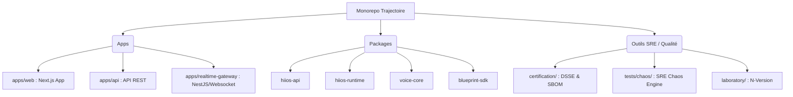
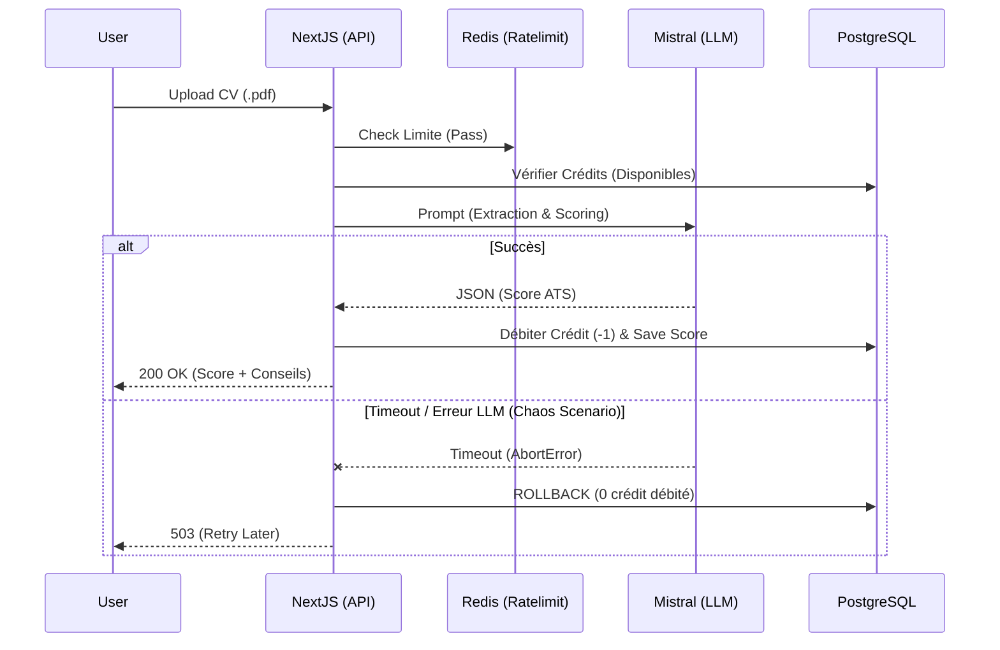

# Phase 1 — Audit d'Architecture (État des Lieux)

**Date :** 2026-07-29  
**Cible :** `Trajectoire` (Monorepo PNPM)  
**Objectif :** Cartographie exhaustive de l'existant.

---

## 1. Architecture Globale (Monorepo)

Le projet utilise une architecture de type **Monorepo** gérée via `pnpm workspace`, séparant strictement les applications frontales, les microservices temps réel et les librairies transversales (domaines, SDKs).

---

## 2. Inventaire Technologique par Domaine

### 🖥️ Frontend
- **Framework :** Next.js 15.5 (App Router)
- **Langage :** TypeScript 5.8
- **Styling :** TailwindCSS (v3/v4 via PostCSS), Radix UI (composants non-stylés)
- **Animations :** Framer Motion 12, Motion DOM
- **Formulaires & Validation :** React Hook Form, Zod
- **State Management :** Zustand

### ⚙️ Backend & API
- **Core HTTP :** Next.js Server Actions / API Routes
- **Temps Réel (Gateway) :** NestJS v11 (Microservice dédié haute performance)
- **Parsing & Data :** Zod (Validation stricte)

### 🗄️ Base de Données
- **Moteur :** PostgreSQL (Hébergé via Supabase)
- **ORM :** Prisma 6.1.0
- **Schéma :** Approche déclarative (`supabase_schema.sql` et `prisma/schema.prisma`). Tables métiers majeures : `profiles`, `evaluations`, `simulations`.
- **Gouvernance :** Row Level Security (RLS) nativement activée sur les tables.

### 🔐 Authentification
- **Fournisseur :** Supabase Auth (`@supabase/ssr`, `@supabase/supabase-js`)
- **Modèle de Données :** La table `profiles` étend nativement `auth.users` via des triggers PostgreSQL (`on_auth_user_created`).
- **Sécurité :** JWT, RLS policies strictes ("Users read own profile").

### 💳 Paiement & Monétisation
- **Fournisseur :** Stripe (`stripe` v18)
- **Intégration :** Webhooks sécurisés avec validation de signature.
- **Métier :** Achat de crédits (ATS) et abonnements (`plan_type: 'free' | 'pro'`). Modèle transactionnel avec clés d'idempotence contre la double-facturation.

### 🧠 LLM (Intelligence Artificielle)
- **Orchestrateur :** Vercel AI SDK (`ai`)
- **Modèles :** 
  - **Mistral AI** (`@mistralai/mistralai`, `@ai-sdk/mistral`) - Utilisé pour l'ATS et l'optimisation CV.
  - **OpenAI** / **Google Generative AI** (disponibles via SDK).
  - **Voice :** ElevenLabs (`elevenlabs`) pour la génération vocale temps réel.

### 🔌 WebSocket & Temps Réel
- **Serveur :** Socket.IO v4 couplé à `@nestjs/websockets`.
- **Client :** `socket.io-client` v4.
- **Usage :** Simulations d'entretiens (SIL) et streaming asynchrone des flux LLM / Voice.

### 🚀 Cache & Files d'Attente
- **Système :** Redis (Upstash) via `ioredis` et `@upstash/redis`.
- **Rate Limiting :** `@upstash/ratelimit` (Protection DDoS).
- **Files d'Attente :** Implémentation custom ou via Redis Streams pour le traitement asynchrone (ex: Webhooks Stripe).

### 📧 Notifications & Emails
- **Fournisseur :** Resend (`resend` v6)
- **Templating :** React Email (`@react-email/components`)
- **Type :** Transactionnels purs (Confirmation, Rapport d'audit, Factures).

### 📦 Stockage
- **Système :** Supabase Storage / Base de données (JSONB pour les rapports).
- **Traitement Fichiers :** `pdf-parse`, `docx`, `sharp` pour l'ingestion de CV (ATS).

### 👁️ Monitoring & Observabilité
- **Error Tracking :** Sentry (`@sentry/nextjs`).
- **Tracing / APM :** OpenTelemetry (`@opentelemetry/sdk-node`, exporter OTLP).
- **Logs :** Pino (`pino`, `pino-pretty`) pour une journalisation structurée.
- **Analytics :** PostHog (`posthog-js`).

### 🏭 CI/CD
- **Outil :** GitHub Actions
- **Stratégie :** Matrice Industrielle (Ubuntu, Windows, macOS) croisée avec Node 20 et Node 22.
- **Reproductibilité :** Forçage du timestamp Git (`SOURCE_DATE_EPOCH`), `core.eol=lf`, contrôle d'entropie intra-runner (Run 1 == Run 2).

### 📜 Certification & Traçabilité (SLSA)
- **Preuves Cryptographiques :** Implémentation DSSE (Dead Simple Signing Envelope) pour l'ensemble des rapports (`manifest.dsse.json`, `release-evidence.dsse.json`).
- **Vérification :** Architecture N-Version. (Laboratoire A en Node.js, Laboratoire B en Python 3.13 en salle blanche) pilotés par un moteur de convergence.
- **SBOM :** Génération CycloneDX et SPDX via `@cyclonedx/cdxgen`.

### 🔥 Chaos Engineering (SRE)
- **Outil :** Framework de Chaos propriétaire (`tests/chaos/`).
- **Cible :** Validation de l'architecture applicative (Idempotence, Circuit Breaker, Exponential Backoff, AbortController) sans polluer le code de test.
- **Scénarios :** Timeout LLM, Perte réseau, Crash BDD, Double webhook Stripe. Oracles "Boîte noire" (état des données uniquement).

### 🛡️ Sécurité
- **Application :** Helmet (Headers HTTP).
- **Architecture :** Séparation Front/API/Worker, Idempotence stricte, RLS sur toutes les tables exposées, Audit régulier des dépendances (`npm audit` / OSSA).

---

## 3. Flux Dépendance Critique (Exemple : ATS LLM)

