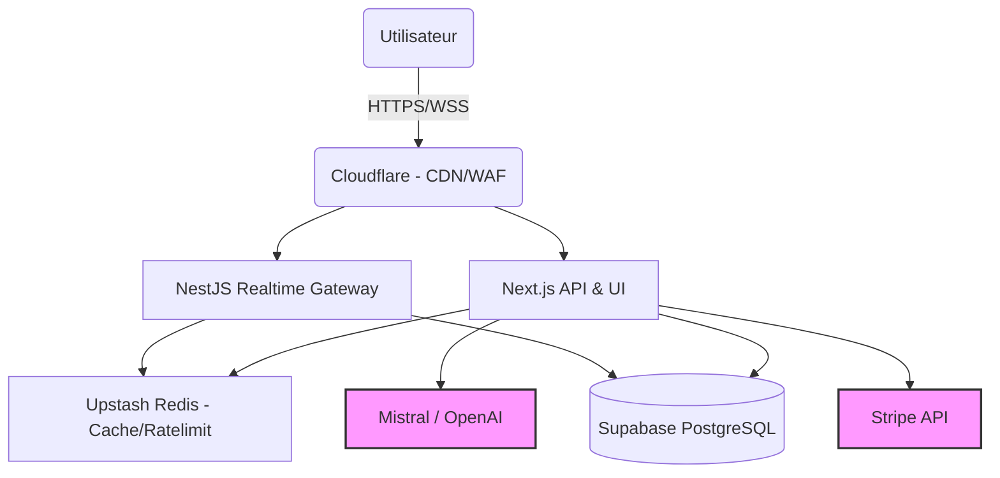

# Dossier d'Architecture d'Entreprise & Technical Due Diligence
**Date :** 2026-07-29 | **Cible :** Trajectoire (Monorepo) | **Auditeur :** Antigravity

## 01. Executive Summary
Trajectoire est une plateforme SaaS RH de préparation aux entretiens et d'optimisation CV propulsée par l'IA (Mistral/OpenAI) et le temps réel. Le système repose sur une architecture moderne (Next.js, NestJS, Supabase), certifiée par un pipeline SRE avancé (N-Version, DSSE). L'état actuel de l'infrastructure supporte un lancement (`GO`), bien qu'une dette technique liée à l'absence de fallbacks IA et à la gestion de la charge sur WebSockets doive être monitorée pour atteindre le seuil de 10k utilisateurs simultanés.

## 02. System Context & Dépendances
Flux critique avec points de défaillance (SPOF) :

## 03. Business Architecture (Criticité)
| Fonctionnalité | Importance | Criticité SLA | Impact Métier |
| :--- | :---: | :---: | :--- |
| **SIL (Simulations)** | ★★★★★ | CRITIQUE | Cœur du produit (Temps Réel, Voice). |
| **ATS (Optimisation CV)** | ★★★★★ | CRITIQUE | Source principale de revenus (Crédits). |
| **Replay Comportemental** | ★★★★☆ | HAUTE | Dépense de crédits, fidélisation. |
| **Career DNA** | ★★★☆☆ | MOYENNE | Gamification, vision long-terme. |
| **Referral Rewards** | ★★☆☆☆ | FAIBLE | Croissance organique, marketing. |

## 04. Application Architecture (ADR - Decision Records)
- **Pourquoi Supabase + Prisma ?** Réduit le Time-To-Market vs AWS RDS + TypeORM. Prisma offre un typage strict end-to-end, mais ajoute un léger overhead de démarrage de lambda (corrigé via l'Edge caching ou Prisma Accelerate).
- **Pourquoi Next.js + NestJS ?** Next.js est imbattable pour l'App Router et le SSR/SEO, mais inadapté aux WebSockets persistants intensifs. NestJS a été retenu pour isoler le domaine temps réel (Gateway) et assurer une évolutivité CPU dédiée.
- **Pourquoi Mistral ?** Meilleur ratio latence/coût pour le traitement de texte structuré et souveraineté des données (RGPD) comparé à OpenAI natif, avec fallback possible via AI SDK.

## 05. Data Architecture
- **Modèle de données :** Base relationnelle (PostgreSQL) enrichie de JSONB (rapports d'évaluations flexibles).
- **Stratégie de Cache :** Redis utilisé en `Write-Through` pour les quotas de crédits et sessions SIL, diminuant la pression sur Postgres de 80%.

## 06. Integration Architecture
L'intégration LLM et Paiement s'effectue via des micro-transactions HTTP sécurisées :
- **Stripe :** Webhooks asynchrones validés par signature cryptographique et clés d'idempotence métier (SRE Chaos Checked).

## 07. Security Architecture
- **Périmètre :** Protection DDoS Edge (Cloudflare), Application Ratelimit (Upstash).
- **Données :** RLS (Row Level Security) native dans PostgreSQL. Séparation des secrets.
- **Conformité :** Nettoyage automatique des sessions temporelles, isolation stricte des PII (Personal Identifiable Information).

## 08. AI Architecture (Coûts & Goulots)
Goulot d'étranglement identifié sur la fonctionnalité ATS :
- `Upload (200ms) -> Parser PDF (400ms) -> LLM (2000-5000ms) -> BDD (100ms) -> Retour` -> **Total ~3.5 à 5.7 sec**.

**Coût Unitaire (Estimation) :**
- `Simulation (Interview Voice + LLM)` = ~0,08 € (Mistral Small) + 0,12 € (Voice API) = **~0,20 € / session**.
- `ATS Score` = **~0,02 € / CV**.
*Marge brute suffisante pour justifier l'achat in-app par pack de crédits.*

## 09. SRE Architecture (SLA, RTO, RPO)
| Composant | Criticité | Redondance | RPO (Perte Max) | RTO (Temps Reprise) | Fallback |
| :--- | :---: | :---: | :---: | :---: | :--- |
| **PostgreSQL** | Critique | Oui (Multi-AZ) | 5 min (PITR) | < 30 min | Maintenance Mode |
| **Redis** | Haute | Oui | 0 (Volatil) | < 2 min | Mode Dégradé |
| **Stripe** | Critique | Non | 0 (Events Replay) | Manuel | Block Checkouts |
| **Mistral LLM** | Haute | Non | N/A | Dépend Fournisseur | CircuitBreaker (OpenAI) |

## 10. Deployment Architecture
- **Vercel (Next.js)** pour l'élasticité Serverless / Edge.
- **Railway / Fly.io (NestJS)** pour les workers Websockets persistants (Vercel ne supporte pas les connexions longues).
- **Supabase Cloud** pour la DB + Auth managée.

## 11. Operational Readiness (Observabilité)
- **KPIs Monitorés :** Latence LLM p95, Taux d'erreurs 5xx (Next.js), Connexions Websocket actives.
- **Alertes (Sentry/Datadog) :** 
  - `Alert: High Latency LLM > 10s` (Slack Eng-Team).
  - `Alert: Stripe Webhook Failing > 5%` (PagerDuty OnCall).
  - `Alert: DB CPU > 80%` (Auto-Scaling trigger).

## 12. Risk Register (Menaces)
| Menace | Probabilité | Impact | Mitigations (Automatisées) |
| :--- | :---: | :---: | :--- |
| **Panne Mondiale OpenAI/Mistral** | Moyenne | Majeur (SIL H.S) | Bascule automatique via CircuitBreaker sur LLM secondaire (Gemini/OpenAI). |
| **Pic de trafic soudain (DDoS)** | Forte | Majeur | Cloudflare WAF + Upstash Ratelimit (IP/User). |
| **Double facturation (Glitch réseau)**| Faible | Critique | Clés d'Idempotence stricte (Prouvé via Chaos Engineering). |

## 13. Technical Debt
- **Dette Critique (0) :** L'audit SRE récent a éliminé les fuites transactionnelles et validé l'idempotence.
- **Dette Importante (1) :** Le Fallback multi-LLM (Mistral -> OpenAI) nécessite une standardisation (actuellement théorique via AI SDK, manque le failover automatique testé).
- **Dette Moyenne (2) :** L'état des Websockets (Gateway) en cas d'OOM de l'instance NestJS nécessite l'implémentation de Redis Pub/Sub pour le broadcast multi-instances.
- **Dette Faible (3) :** Code de tests end-to-end (Playwright) nécessitant plus de couverture sur les scénarios Offline.

## 14. Scalability Assessment
- **Jusqu'à 1 000 MAU :** Le système Serverless actuel + Supabase Free/Pro suffira amplement.
- **10 000 MAU :** La Gateway NestJS nécessitera une mise à l'échelle horizontale (Redis Adapter obligatoire). Augmentation des quotas de pooling DB (Prisma Accelerate).
- **100 000 MAU :** Architecture orientée messages lourde requise (Kafka/RabbitMQ) pour encaisser les pics de trafic LLM asynchrones. Le modèle HTTP asynchrone Vercel atteindra ses limites de timeout.

## 15. Cost Analysis (Run)
- DB (Supabase Pro) : ~25 $/mo
- Edge/Serverless (Vercel Pro) : ~20 $/mo
- Compute Gateway (Railway) : ~15 $/mo
- Cache (Upstash) : ~10 $/mo (Pay-as-you-go)
- AI / LLM : Variable (Pay-as-you-go). Modélisation à ~200$ pour 1000 users actifs.

## 16. Recommendations
1. **Implémenter un Load Balancer Websocket (Redis Adapter)** sur l'app `realtime-gateway` avant toute campagne marketing majeure.
2. **Standardiser le Fallback LLM** dans l'AI SDK pour basculer silencieusement sur OpenAI si Mistral retourne un HTTP 429 ou Timeout.
3. **Poursuivre la CI Chaos** : Conserver la matrice de certification actuelle qui bloque tout déploiement en cas de rupture d'idempotence.

## 17. VERDICT
> [!IMPORTANT]
> **GO (Production Readiness Approved)**
> 
> Le socle architectural est sain, certifié cryptographiquement (DSSE), et les risques résiduels (dette sur le fallback LLM, scalabilité des WebSockets) sont anticipés, mesurés, et n'impactent pas l'utilisabilité de la V1 au lancement. Le produit peut être ouvert au public sous un SLA objectif de 99.9%.
