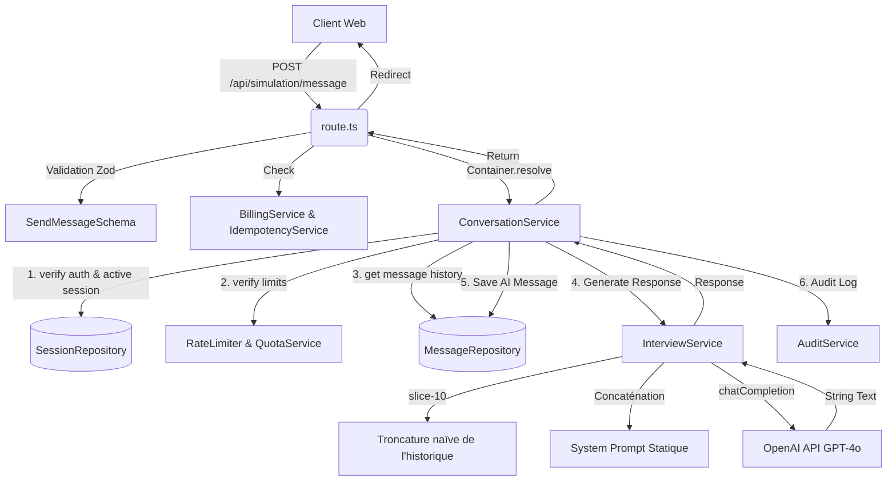
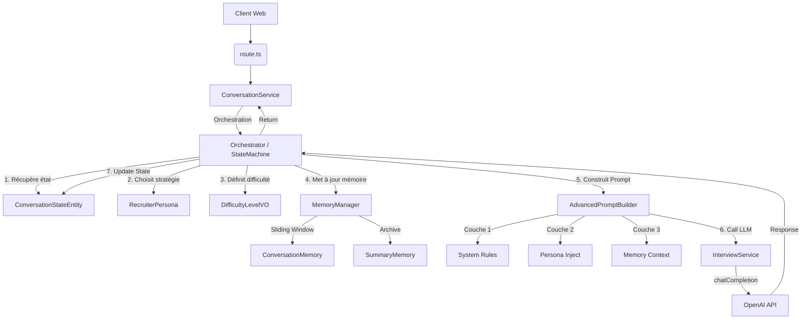

# Call Graph - Moteur d'Entretien

Ce graphe retrace les appels réels lors de l'envoi d'un message par l'utilisateur, basé sur le code actuel. Le flux théorique prévu par l'architecture DDD est comparé au flux réel.

## 1. Flux Réel (Ce qui tourne en production)

### Constat sur le flux réel :
- L'appel direct de `ConversationService` à `InterviewService` ignore toute couche d'orchestration ou de logique métier avancée (Personas, Mémoire intelligente).
- Tout repose sur OpenAI, le code sert de simple tunnel.

---

## 2. Flux Théorique (Prévu par l'architecture, mais non connecté)

### Analyse des divergences :
Le flux théorique a été partiellement codé (les briques `S`, `P`, `D`, `M`, `PB` existent dans le code), mais l'orchestrateur `O` qui était censé tout lier **n'existe pas**. En conséquence, l'application a court-circuité toutes les briques pour relier directement `E` à `I` via un appel `slice` brutal sur l'historique.
