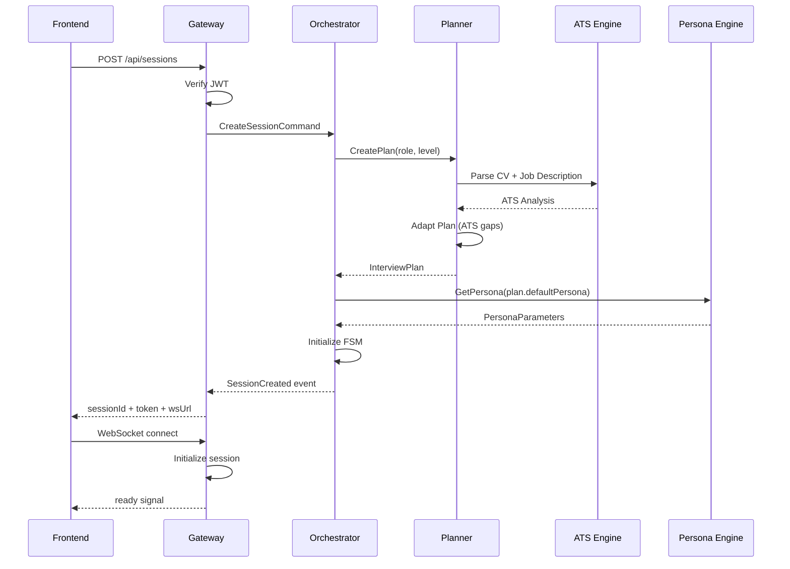
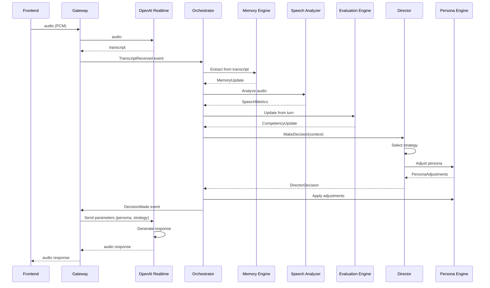

# Architecture Enterprise - Moteur de Simulation d'Entretien IA V2

## Table des matières

1. [Vue d'ensemble](#vue-densemble)
2. [Structure des dossiers](#structure-des-dossiers)
3. [Composants principaux](#composants-principaux)
4. [Flux de données](#flux-de-données)
5. [Diagrammes de séquence](#diagrammes-de-séquence)
6. [FSM - Machine à états](#fsm---machine-à-états)
7. [Event Bus](#event-bus)
8. [Monitoring & Observabilité](#monitoring--observabilité)
9. [Scalabilité](#scalabilité)
10. [Sécurité](#sécurité)

---

## Vue d'ensemble

### Objectifs

- Créer un moteur de simulation d'entretien IA extrêmement réaliste
- Dépasser les plateformes existantes (Google Interview Warmup, Pramp, Final Round AI, etc.)
- Architecture modulaire, scalable, testable, déterministe
- Supporter plusieurs centaines de conversations simultanées
- Séparation stricte : Gateway (transport) vs Orchestrator (logique métier)

### Principes architecturaux

- **DDD + Hexagonal Architecture** : Domain pur, infrastructure découplée
- **CQRS** : Séparation lecture/écriture
- **Event Driven** : Communication asynchrone via Event Bus
- **SOLID** : Single Responsibility, Open/Closed, etc.
- **Vertical Slice** : Organisation par fonctionnalité
- **Strict Type Safety** : TypeScript strict, Zod validation

### Stack technique

**Frontend**
- Next.js 15 (App Router)
- React 18
- TypeScript 5
- TailwindCSS

**Backend**
- Fastify (Realtime Gateway)
- NestJS (Interview Orchestrator)
- OpenAI Realtime API
- WebRTC
- Redis (Cache + Event Bus)
- Supabase (PostgreSQL)
- BullMQ (Job Queue)
- JWT (Auth)
- Zod (Validation)
- Prisma (ORM)

---

## Structure des dossiers

```
trajectoire-v2/
├── apps/
│   ├── web/                          # Next.js Frontend
│   │   ├── src/
│   │   │   ├── app/                  # App Router
│   │   │   │   ├── interview/        # Interview pages
│   │   │   │   ├── dashboard/       # Dashboard
│   │   │   │   └── reporting/       # Reports
│   │   │   ├── components/
│   │   │   │   ├── interview/        # Interview UI components
│   │   │   │   ├── audio/            # Audio components
│   │   │   │   └── webrtc/           # WebRTC components
│   │   │   ├── lib/
│   │   │   │   ├── api/              # API clients
│   │   │   │   └── hooks/            # Custom hooks
│   │   │   └── types/
│   │   └── package.json
│   │
│   ├── realtime-gateway/             # Fastify + WebRTC + OpenAI Realtime
│   │   ├── src/
│   │   │   ├── gateway/              # Gateway core
│   │   │   │   └── gateway.ts        # Main gateway class
│   │   │   ├── auth/
│   │   │   │   └── jwt-verifier.ts   # JWT verification
│   │   │   ├── session/
│   │   │   │   └── session-manager.ts # Session lifecycle
│   │   │   ├── webrtc/
│   │   │   │   └── webrtc-manager.ts # WebRTC signaling
│   │   │   ├── audio/
│   │   │   │   └── audio-processor.ts # Audio processing
│   │   │   ├── openai/
│   │   │   │   └── openai-adapter.ts # OpenAI Realtime adapter
│   │   │   ├── telemetry/
│   │   │   │   └── telemetry-service.ts # Metrics + logs
│   │   │   └── logging/
│   │   │       └── gateway-logger.ts # Structured logging
│   │   └── package.json
│   │
│   └── interview-orchestrator/       # NestJS Business Logic
│       ├── src/
│       │   ├── modules/              # Vertical Slices
│       │   │   ├── interview/        # Interview module
│       │   │   │   ├── application/  # Use cases
│       │   │   │   ├── domain/       # Domain logic
│       │   │   │   ├── infrastructure/ # Repositories
│       │   │   │   └── presentation/ # Controllers
│       │   │   ├── planner/           # Interview Planner
│       │   │   ├── director/          # Conversation Director
│       │   │   ├── persona/           # Persona Engine
│       │   │   ├── memory/            # Memory Engine
│       │   │   ├── evaluation/        # Evaluation Engine
│       │   │   ├── speech/            # Speech Analyzer
│       │   │   ├── contradiction/     # Contradiction Detector
│       │   │   ├── star/              # STAR Detector
│       │   │   ├── ats/               # ATS Engine
│       │   │   ├── career-dna/        # Career DNA Engine
│       │   │   ├── reporting/         # Reporting Engine
│       │   │   ├── difficulty/        # Difficulty Engine
│       │   │   └── session/           # Session Manager
│       │   ├── shared/
│       │   │   ├── domain/            # Shared domain
│       │   │   ├── infrastructure/    # Shared infrastructure
│       │   │   ├── application/       # Shared application
│       │   │   └── event-bus/         # Event Bus
│       │   └── main.ts
│       └── package.json
│
├── libs/
│   ├── domain/                       # Pure Domain (DDD)
│   │   ├── src/
│   │   │   ├── interview/
│   │   │   │   ├── entities/
│   │   │   │   │   └── InterviewSession.ts
│   │   │   │   ├── value-objects/
│   │   │   │   │   ├── InterviewPlan.ts
│   │   │   │   │   └── StageObjective.ts
│   │   │   │   ├── events/
│   │   │   │   └── repositories/
│   │   │   ├── candidate/
│   │   │   ├── competency/
│   │   │   ├── persona/
│   │   │   │   └── value-objects/
│   │   │   │       └── PersonaParameters.ts
│   │   │   ├── memory/
│   │   │   │   └── value-objects/
│   │   │   │       └── CandidateMemory.ts
│   │   │   ├── evaluation/
│   │   │   │   └── value-objects/
│   │   │   │       └── CompetencyEvaluation.ts
│   │   │   └── director/
│   │   │       └── value-objects/
│   │   │           └── DirectorDecision.ts
│   │   └── package.json
│   │
│   └── shared/                       # Shared utilities
│       ├── src/
│       │   ├── types/
│       │   ├── utils/
│       │   └── constants/
│       └── package.json
│
├── infrastructure/
│   ├── database/
│   │   ├── prisma/
│   │   │   ├── schema.prisma
│   │   │   └── migrations/
│   │   └── supabase/
│   │       ├── functions/
│   │       └── rpc/
│   │
│   ├── redis/
│   │   ├── scripts/
│   │   └── config/
│   │
│   └── event-bus/
│       ├── bullmq/
│       └── redis-streams/
│
└── tools/
    ├── monitoring/
    │   ├── grafana/
    │   └── prometheus/
    └── documentation/
        └── architecture/
```

---

## Composants principaux

### 1. Realtime Gateway (Fastify)

**Responsabilités**
- WebRTC signaling
- Session management
- JWT verification
- Audio processing
- OpenAI Realtime connection
- Heartbeat monitoring
- Metrics collection
- Logging

**AUCUNE logique métier**

```typescript
// apps/realtime-gateway/src/gateway/gateway.ts
export class RealtimeGateway {
  private app: Fastify.Instance;
  private sessionManager: SessionManager;
  private webrtcManager: WebRTCManager;
  private audioProcessor: AudioProcessor;
  private openaiAdapter: OpenAIRealtimeAdapter;
  private telemetry: TelemetryService;
  private logger: GatewayLogger;

  // WebSocket endpoint
  // REST API for session management
  // Error handling
}
```

**Endpoints**
- `GET /health` - Health check
- `GET /ws/interview/:sessionId` - WebSocket connection
- `POST /api/sessions` - Create session
- `GET /api/sessions/:sessionId` - Get session
- `DELETE /api/sessions/:sessionId` - Delete session

### 2. Interview Orchestrator (NestJS)

**Responsabilités**
- Coordination de tous les moteurs
- Gestion du cycle de vie de l'entretien
- Communication avec le Gateway via Event Bus
- Orchestration des décisions métier

```typescript
// apps/interview-orchestrator/src/modules/interview/interview.service.ts
export class InterviewService {
  constructor(
    private planner: InterviewPlanner,
    private director: ConversationDirector,
    private personaEngine: PersonaEngine,
    private memoryEngine: MemoryEngine,
    private evaluationEngine: EvaluationEngine,
    private eventBus: EventBus,
  ) {}

  async startInterview(command: StartInterviewCommand): Promise<InterviewSession> {
    // Create plan
    // Initialize session
    // Start FSM
    // Emit events
  }

  async processTurn(command: ProcessTurnCommand): Promise<DirectorDecision> {
    // Analyze speech
    // Update memory
    // Evaluate competencies
    // Director makes decision
    // Update persona
    // Return decision to Gateway
  }
}
```

### 3. Interview Planner

**Responsabilités**
- Créer un plan complet d'entretien
- Définir les stages et objectifs
- Configurer les transitions
- Adapter le plan selon ATS

```typescript
// apps/interview-orchestrator/src/modules/planner/planner.service.ts
export class InterviewPlanner {
  async createPlan(request: PlanRequest): Promise<InterviewPlan> {
    // Select template based on role
    // Customize based on ATS data
    // Configure stages and transitions
    // Set difficulty progression
    // Return plan
  }

  async adaptPlan(plan: InterviewPlan, atsData: ATSData): Promise<InterviewPlan> {
    // Add stages for missing competencies
    // Adjust difficulty based on seniority
    // Focus on ATS-detected gaps
  }
}
```

**Stages d'entretien**
1. Introduction
2. Ice breaker
3. Presentation
4. Experience
5. Leadership
6. Conflict
7. Architecture
8. System Design
9. Algorithms
10. Behavioral
11. Culture Fit
12. Candidate Questions
13. Conclusion

### 4. Conversation Director

**Responsabilités**
- Décider quelle compétence tester
- Choisir la stratégie employée
- Décider quand changer de sujet
- Décider quand approfondir
- Décider quand interrompre
- Décider quand conclure

**NE génère JAMAIS de texte**

```typescript
// apps/interview-orchestrator/src/modules/director/director.service.ts
export class ConversationDirector {
  async makeDecision(context: DirectorContext): Promise<DirectorDecision> {
    // Analyze candidate state
    // Check strategy conditions
    // Select appropriate action
    // Adjust persona if needed
    // Return decision (not text)
  }

  private selectStrategy(context: DirectorContext): ConversationStrategy {
    // Based on stress, confidence, time, competency
  }

  private adjustPersona(decision: DirectorDecision): PersonaAdjustments {
    // Increase/decrease pressure
    // Change tone
    // Adjust followup strategy
  }
}
```

**Actions possibles**
- `continue_current_topic`
- `change_topic`
- `deepen_current_topic`
- `interrupt`
- `follow_up`
- `challenge`
- `request_metrics`
- `request_evidence`
- `slow_down`
- `speed_up`
- `increase_pressure`
- `decrease_pressure`
- `revisit_topic`
- `detect_evasion`
- `detect_ai_response`
- `detect_vague_response`
- `conclude_stage`
- `move_to_next_stage`

### 5. Persona Engine

**Responsabilités**
- Produire UNIQUEMENT des paramètres
- JAMAIS de réponses
- Ajuster dynamiquement le persona

```typescript
// apps/interview-orchestrator/src/modules/persona/persona.service.ts
export class PersonaEngine {
  getParameters(personaId: string): PersonaParameters {
    // Return predefined parameters
  }

  adjustParameters(
    base: PersonaParameters,
    adjustments: PersonaAdjustments
  ): PersonaParameters {
    // Apply adjustments
    // Ensure constraints (0-10 ranges)
  }

  validateParameters(params: PersonaParameters): boolean {
    // Validate ranges
    // Check consistency
  }
}
```

**Paramètres du persona**
- warmth (0-10)
- pressure (0-10)
- aggressiveness (0-10)
- verbosity (0-10)
- interruptions (0-10)
- thinking time (0-10)
- tone (warm/neutral/direct/incisive)
- energy (low/moderate/high)
- followup strategy
- followup depth (0-5)
- technical focus (0-10)
- humor (0-10)
- curiosity (0-10)
- empathy (0-10)

### 6. Memory Engine

**Responsabilités**
- Stocker une mémoire structurée (PAS une conversation)
- Extraire et organiser les informations
- Maintenir l'état du candidat

```typescript
// apps/interview-orchestrator/src/modules/memory/memory.service.ts
export class MemoryEngine {
  async extractFromTranscript(transcript: string): Promise<MemoryUpdate> {
    // Extract projects
    // Extract companies
    // Extract skills
    // Extract achievements
    // Extract leadership examples
    // Detect STAR elements
  }

  async updateMemory(sessionId: string, update: MemoryUpdate): Promise<CandidateMemory> {
    // Merge with existing memory
    // Detect contradictions
    // Update communication profile
    // Update stress profile
  }

  async getSnapshot(sessionId: string): Promise<CandidateMemory> {
    // Return current memory state
  }
}
```

**Structure de la mémoire**
- Projects
- Companies
- Skills
- Achievements
- Failures
- Leadership examples
- STAR elements
- Answer quality
- Contradictions
- Pending topics
- Communication profile
- Stress profile
- Confidence

### 7. Evaluation Engine

**Responsabilités**
- Évaluer en continu (PAS uniquement à la fin)
- Calculer les scores par compétence
- Maintenir l'historique des évaluations

```typescript
// apps/interview-orchestrator/src/modules/evaluation/evaluation.service.ts
export class EvaluationEngine {
  async evaluateCompetency(
    sessionId: string,
    competency: Competency,
    evidence: Evidence[]
  ): Promise<CompetencyScore> {
    // Calculate score based on evidence
    // Update confidence
    // Determine trend
  }

  async getSnapshot(sessionId: string): Promise<EvaluationSnapshot> {
    // Aggregate all competency scores
    // Calculate overall score
    // Identify strengths/weaknesses
    // Generate recommendations
  }

  async updateFromTurn(turn: Turn): Promise<void> {
    // Extract evidence from turn
    // Update relevant competencies
    // Detect red flags
  }
}
```

**Compétences évaluées**
- Leadership
- Ownership
- Communication
- Architecture
- Algorithms
- Problem solving
- Debugging
- Product sense
- Mentoring
- Learning
- Conflict
- Influence
- Decision making
- Technical depth
- Business impact

### 8. Speech Analyzer

**Responsabilités**
- Analyser les patterns de parole
- Détecter les fillers
- Mesurer les hésitations
- Calculer le speech rate
- Évaluer la clarté

```typescript
// apps/interview-orchestrator/src/modules/speech/speech.service.ts
export class SpeechAnalyzer {
  async analyzeAudio(audioBuffer: Buffer): Promise<SpeechMetrics> {
    // Detect fillers
    // Measure hesitations
    // Calculate speech rate
    // Analyze energy
    // Detect emotion
  }

  async detectFillers(transcript: string): Promise<FillerAnalysis> {
    // Count "um", "uh", "like", etc.
    // Calculate frequency
  }

  async measureHesitations(audioBuffer: Buffer): Promise<HesitationAnalysis> {
    // Detect pauses
    // Measure duration
    // Calculate frequency
  }
}
```

### 9. Contradiction Detector

**Responsabilités**
- Détecter les incohérences
- Dates incohérentes
- Chiffres incohérents
- Responsabilités contradictoires
- Technologies incompatibles
- Chronologie impossible

```typescript
// apps/interview-orchestrator/src/modules/contradiction/contradiction.service.ts
export class ContradictionDetector {
  async detect(memory: CandidateMemory): Promise<Contradiction[]> {
    // Check date consistency
    // Check number consistency
    // Check responsibility consistency
    // Check technology compatibility
    // Check chronology
  }

  async validateStatement(statement: string, memory: CandidateMemory): Promise<boolean> {
    // Check against existing memory
    // Flag contradictions
  }
}
```

### 10. STAR Detector

**Responsabilités**
- Détecter automatiquement les éléments STAR
- Situation
- Task
- Action
- Result
- Demander les éléments manquants

```typescript
// apps/interview-orchestrator/src/modules/star/star.service.ts
export class STARDetector {
  async detectElements(answer: string): Promise<STARElement> {
    // Extract Situation
    // Extract Task
    // Extract Action
    // Extract Result
    // Calculate completeness
  }

  async identifyMissingElements(element: STARElement): Promise<string[]> {
    // Return missing STAR elements
  }
}
```

### 11. ATS Engine

**Responsabilités**
- Importer CV et Job Description
- Extraire les compétences attendues
- Identifier les compétences absentes
- Adapter le Planner automatiquement

```typescript
// apps/interview-orchestrator/src/modules/ats/ats.service.ts
export class ATSEngine {
  async parseCV(cvText: string): Promise<CVData> {
    // Extract skills
    // Extract experience
    // Extract education
  }

  async parseJobDescription(jobText: string): Promise<JobData> {
    // Extract required skills
    // Extract responsibilities
    // Extract seniority level
  }

  async compare(cv: CVData, job: JobData): Promise<ATSAnalysis> {
    // Identify skill gaps
    // Calculate match score
    // Generate recommendations
  }

  async adaptPlan(plan: InterviewPlan, analysis: ATSAnalysis): Promise<InterviewPlan> {
    // Add stages for missing skills
    // Focus on gaps
    // Adjust difficulty
  }
}
```

### 12. Career DNA Engine

**Responsabilités**
- Identifier les traits de personnalité
- Communication
- Leadership
- Motivation
- Curiosité
- Rigueur
- Ownership
- Style d'apprentissage
- Prise de décision

```typescript
// apps/interview-orchestrator/src/modules/career-dna/career-dna.service.ts
export class CareerDNAEngine {
  async analyze(memory: CandidateMemory): Promise<CareerDNA> {
    // Analyze communication style
    // Identify leadership patterns
    // Assess motivation
    // Evaluate curiosity
    // Measure rigor
    // Detect ownership
    // Identify learning style
    // Analyze decision making
  }

  async generateReport(dna: CareerDNA): Promise<DNAReport> {
    // Generate comprehensive report
    // Provide recommendations
  }
}
```

### 13. Difficulty Engine

**Responsabilités**
- Faire évoluer la difficulté dynamiquement
- Dépend des réponses, temps, stress, confiance
- Ajuster selon les compétences détectées

```typescript
// apps/interview-orchestrator/src/modules/difficulty/difficulty.service.ts
export class DifficultyEngine {
  async calculateNextDifficulty(
    current: number,
    context: DifficultyContext
  ): Promise<number> {
    // Based on answer quality
    // Based on stress level
    // Based on confidence
    // Based on time elapsed
  }

  async shouldIncreaseDifficulty(context: DifficultyContext): Promise<boolean> {
    // If candidate performing well
    // If stress is manageable
    // If time allows
  }
}
```

### 14. Reporting Engine

**Responsabilités**
- Produire le rapport final
- Timeline
- Score radar
- Forces/faiblesses
- Compétences
- Questions difficiles
- Contradictions
- Speech analysis
- STAR completeness
- Plan d'amélioration
- Roadmap personnalisée

```typescript
// apps/interview-orchestrator/src/modules/reporting/reporting.service.ts
export class ReportingEngine {
  async generateReport(sessionId: string): Promise<InterviewReport> {
    // Aggregate evaluation data
    // Generate timeline
    // Create score radar
    // Identify strengths/weaknesses
    // List difficult questions
    // Highlight contradictions
    // Analyze speech patterns
    // Check STAR completeness
    // Generate improvement plan
    // Create personalized roadmap
  }

  async exportPDF(report: InterviewReport): Promise<Buffer> {
    // Generate PDF report
  }
}
```

---

## Flux de données

### 1. Initialisation de l'entretien

```
Frontend → Gateway → Orchestrator → Planner → ATS Engine → Plan
                                                    ↓
Frontend → Gateway ← Orchestrator ← Plan ← Persona Engine
```

### 2. Tour de conversation

```
Frontend → Gateway (audio) → OpenAI Realtime (transcript)
                                    ↓
                          Orchestrator (via Event Bus)
                                    ↓
                    ┌───────────────┼───────────────┐
                    ↓               ↓               ↓
              Memory Engine   Speech Analyzer   Evaluation Engine
                    ↓               ↓               ↓
                    └───────────────┼───────────────┘
                                    ↓
                            Director (decision)
                                    ↓
                            Persona Engine (adjust)
                                    ↓
                            Orchestrator (via Event Bus)
                                    ↓
                            Gateway (via Event Bus)
                                    ↓
                            OpenAI Realtime (parameters)
                                    ↓
                            OpenAI Realtime (audio response)
                                    ↓
                            Gateway (audio)
                                    ↓
                            Frontend
```

### 3. Transition de stage

```
Planner (exit condition) → Director (validate) → FSM (transition)
                                                              ↓
                                                    Orchestrator (update)
                                                              ↓
                                                    Event Bus (publish)
                                                              ↓
                                                    Gateway (notify)
                                                              ↓
                                                    Frontend (update UI)
```

---

## Diagrammes de séquence

### Initialisation de l'entretien



### Tour de conversation



---

## FSM - Machine à états

### États de l'entretien

```typescript
enum InterviewState {
  CREATED = 'created',
  INITIALIZED = 'initialized',
  IN_PROGRESS = 'in_progress',
  PAUSED = 'paused',
  COMPLETED = 'completed',
  CANCELLED = 'cancelled',
  ERROR = 'error',
}
```

### Transitions validées

```typescript
const TRANSITIONS: Record<InterviewState, InterviewState[]> = {
  [InterviewState.CREATED]: [InterviewState.INITIALIZED, InterviewState.CANCELLED],
  [InterviewState.INITIALIZED]: [InterviewState.IN_PROGRESS, InterviewState.CANCELLED],
  [InterviewState.IN_PROGRESS]: [InterviewState.PAUSED, InterviewState.COMPLETED, InterviewState.CANCELLED, InterviewState.ERROR],
  [InterviewState.PAUSED]: [InterviewState.IN_PROGRESS, InterviewState.CANCELLED],
  [InterviewState.COMPLETED]: [],
  [InterviewState.CANCELLED]: [],
  [InterviewState.ERROR]: [InterviewState.CANCELLED],
};
```

### Transitions versionnées

Chaque transition est :
- Validée
- Versionnée
- Loggée
- Irreversible

```typescript
interface InterviewTransition {
  id: string;
  fromStage: InterviewStage;
  toStage: InterviewStage;
  timestamp: Date;
  version: number;
  reason: string;
  triggeredBy: 'system' | 'director' | 'manual';
}
```

---

## Event Bus

### Architecture

- **Redis Streams** pour le streaming d'événements
- **BullMQ** pour les jobs asynchrones
- **Event Sourcing** pour la reconstitution d'état

### Événements principaux

```typescript
// Session events
SessionCreated
SessionInitialized
SessionStarted
SessionPaused
SessionResumed
SessionCompleted
SessionCancelled
SessionError

// Turn events
TurnStarted
TranscriptReceived
SpeechAnalyzed
MemoryUpdated
EvaluationUpdated
DecisionMade
TurnCompleted

// Stage events
StageStarted
StageCompleted
StageTransitionRequested
StageTransitionApproved
StageTransitionRejected

// Persona events
PersonaAdjusted
PressureIncreased
PressureDecreased

// Evaluation events
CompetencyUpdated
ContradictionDetected
STARElementDetected
```

### Exemple d'utilisation

```typescript
// Publisher
await this.eventBus.publish('SessionCreated', {
  sessionId,
  userId,
  planId,
  timestamp: new Date(),
});

// Subscriber
this.eventBus.subscribe('SessionCreated', async (event) => {
  await this.handleSessionCreated(event);
});
```

---

## Monitoring & Observabilité

### Métriques

**Gateway**
- Active sessions count
- WebSocket connections count
- Audio latency
- OpenAI API latency
- Error rate
- Heartbeat success rate

**Orchestrator**
- Decision latency
- Memory update latency
- Evaluation latency
- Event processing time
- FSM transition count
- Strategy selection distribution

### Logs

**Structured logging avec correlation ID**

```typescript
this.logger.info('Session created', {
  sessionId,
  userId,
  planId,
  correlationId,
  timestamp: new Date(),
});
```

### Tracing

**Distributed tracing avec OpenTelemetry**

```typescript
const span = this.tracer.startSpan('process_turn', {
  attributes: {
    sessionId,
    turnNumber,
  },
});

try {
  // Process turn
  span.setStatus({ code: SpanStatusCode.OK });
} catch (error) {
  span.recordException(error);
  span.setStatus({ code: SpanStatusCode.ERROR });
} finally {
  span.end();
}
```

### Alerts

**Grafana + Prometheus**

- Active sessions > threshold
- Error rate > threshold
- Latency > threshold
- OpenAI API failures
- Redis connection failures

---

## Scalabilité

### Horizontal scaling

**Gateway**
- Stateless design
- Redis for session state
- Load balancer with sticky sessions (WebSocket)

**Orchestrator**
- Stateless design
- Event Bus for coordination
- Worker pool for CPU-intensive tasks

### Vertical scaling

**Gateway**
- Audio processing optimization
- WebRTC connection pooling
- OpenAI connection pooling

**Orchestrator**
- Memory optimization
- Evaluation caching
- Decision caching

### Auto-scaling

**Kubernetes HPA**

```yaml
apiVersion: autoscaling/v2
kind: HorizontalPodAutoscaler
metadata:
  name: gateway-hpa
spec:
  scaleTargetRef:
    apiVersion: apps/v1
    kind: Deployment
    name: realtime-gateway
  minReplicas: 3
  maxReplicas: 20
  metrics:
  - type: Resource
    resource:
      name: cpu
      target:
        type: Utilization
        averageUtilization: 70
```

---

## Sécurité

### Authentication

**JWT verification**

```typescript
async function verifyJWT(token: string, secret: string): Promise<JWTPayload> {
  try {
    return jwt.verify(token, secret) as JWTPayload;
  } catch (error) {
    throw new UnauthorizedException('Invalid token');
  }
}
```

### Authorization

**Role-based access control**

```typescript
@Injectable()
export class RolesGuard implements CanActivate {
  canActivate(context: ExecutionContext): boolean {
    const request = context.switchToHttp().getRequest();
    const user = request.user;
    return user.roles.includes('admin');
  }
}
```

### Rate limiting

**Per-user rate limiting**

```typescript
await this.app.register(require('@fastify/rate-limit'), {
  max: 100,
  timeWindow: '1 minute',
  skipOnError: true,
});
```

### Data encryption

**Encryption at rest (Supabase)**
**Encryption in transit (TLS 1.3)**

### Input validation

**Zod schemas**

```typescript
const CreateSessionSchema = z.object({
  userId: z.string().uuid(),
  planId: z.string().uuid(),
  targetRole: z.string(),
  targetLevel: z.string(),
});
```

---

## Conclusion

Cette architecture Enterprise fournit une base solide pour un moteur de simulation d'entretien IA extrêmement réaliste et scalable. Les principaux avantages sont :

1. **Séparation des responsabilités** : Gateway (transport) vs Orchestrator (logique métier)
2. **Modularité** : Chaque moteur est indépendant et testable
3. **Scalabilité** : Architecture stateless avec Event Bus
4. **Déterminisme** : FSM versionnée et transitions validées
5. **Observabilité** : Monitoring complet avec métriques, logs et tracing
6. **Sécurité** : Auth, authorization, rate limiting, encryption

L'architecture est prête pour la production et peut supporter plusieurs centaines de conversations simultanées.
