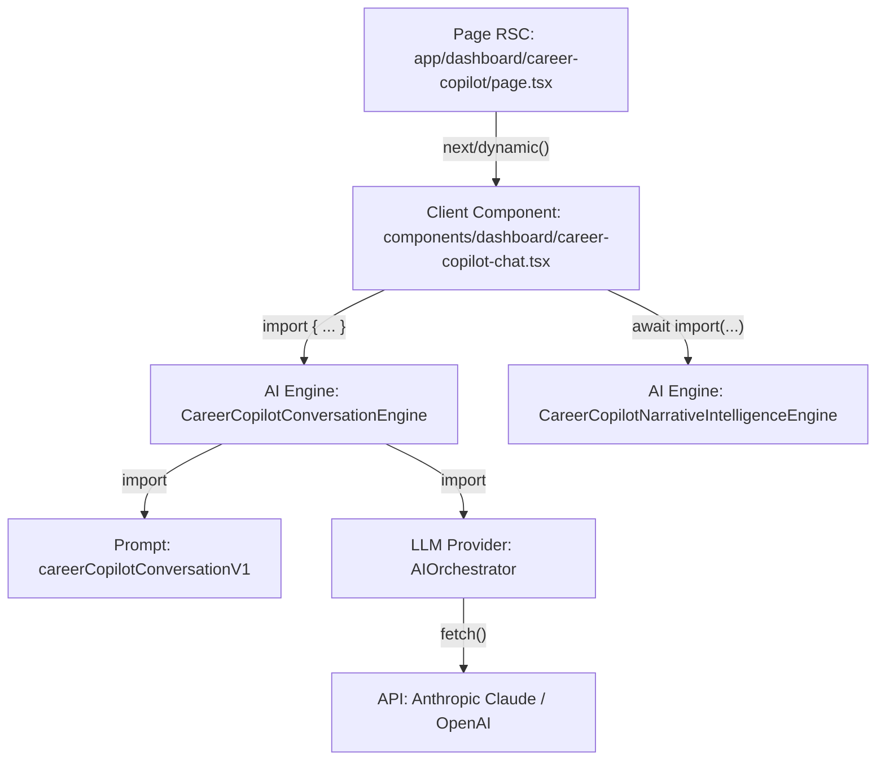
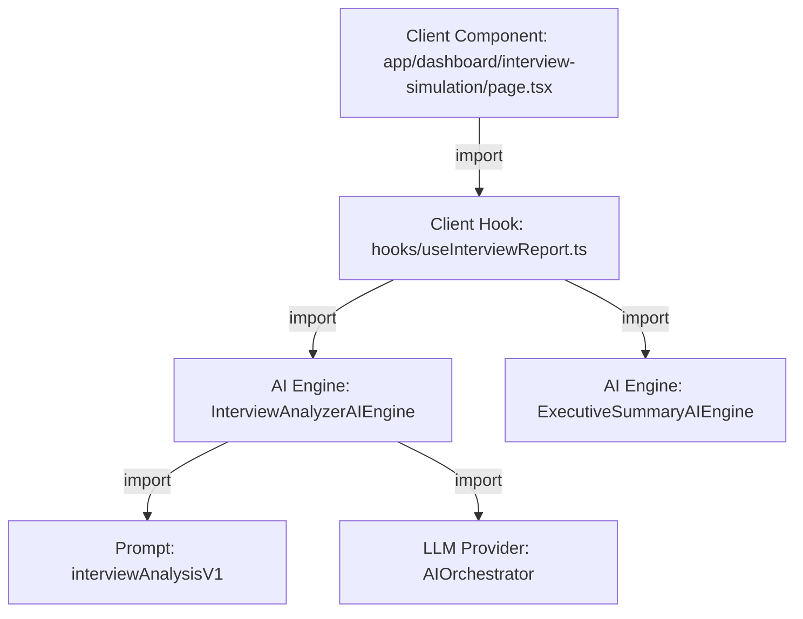
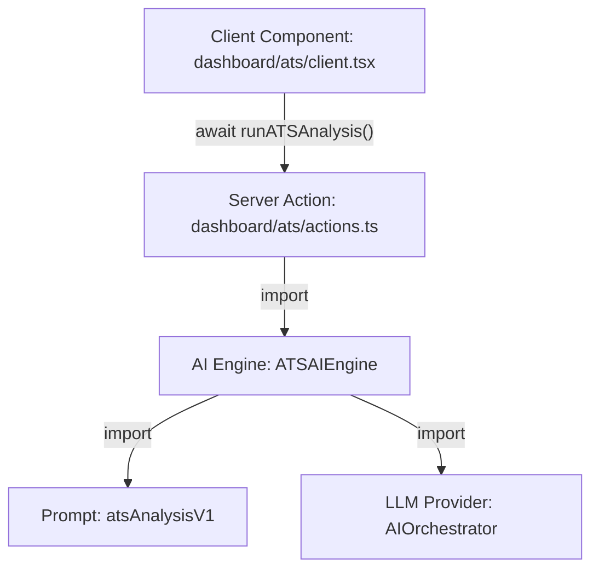

# AI Import Graph

## Objectif
Reconstruire l'arbre complet des dépendances pour chaque domaine afin d'identifier précisément l'endroit où la frontière serveur est rompue.

---

## 1. Graphe d'import compromis : Career Copilot

Ce graphe illustre la chaîne d'inclusion responsable de la taille massive de la page `/dashboard/career-copilot`.

**Point de rupture** : L'import depuis `career-copilot-chat.tsx` (marqué `"use client"`) vers `core/intelligence/engines/*`. En important statiquement et dynamiquement les moteurs depuis l'UI, Webpack inclut tout le sous-graphe (Prompts, Orchestrator, Zod, etc.) dans le bundle client.

---

## 2. Graphe d'import compromis : Interview Simulation

Ce graphe illustre comment la génération du rapport de fin d'entretien pollue le First Load JS.

**Point de rupture** : Le hook custom `useInterviewReport.ts` est consommé par un Client Component. Il importe directement les moteurs d'IA pour exécuter l'analyse localement (ce qui déclenche l'appel réseau vers l'API du LLM depuis le client ou depuis une route générique `AIOrchestrator`, mais toute la logique de prompt reste côté client).

---

## 3. Graphe d'import valide : ATS (Référence)

Ce graphe illustre l'architecture correcte utilisée sur d'autres parties de l'application (ex: Dashboard ATS).

**Explication** : La frontière est fermée par le fichier `actions.ts` contenant la directive `"use server"`. Le composant client ne connaît que la signature de la Server Action. Webpack crée un point d'entrée RPC et **n'inclut pas** le graphe sous-jacent dans le bundle client.
