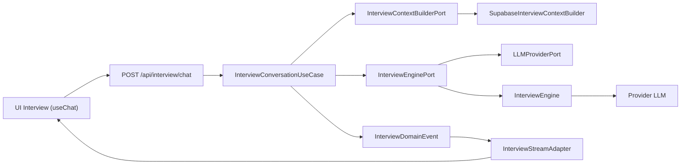

# Contrat de domaine — Interview AI Domain

**Statut :** Proposition à valider avant Sprint 6.7.2  
**Portée :** contrat d'architecture uniquement ; aucune implémentation n'est définie dans ce document.

## Décision de conception

Interview adopte le même standard que Career Copilot :

```text
UI client -> Route Handler -> Use Case -> Context Builder -> Conversation Engine -> LLM Provider
```

Le flux est un flux de **domain events**. L'AI SDK, Next.js, React, Supabase et HTTP sont des détails d'infrastructure : aucun type de ces technologies ne traverse la frontière du domaine.

## Diagramme d'architecture



## Structure cible

```text
lib/interview/
├─ application/
│  └─ use-cases/
│     └─ interview-conversation.use-case.ts
├─ domain/
│  ├─ contracts/
│  │  ├─ interview.dto.ts
│  │  ├─ interview.events.ts
│  │  ├─ interview.errors.ts
│  │  └─ error.mapper.ts
│  └─ ports/
│     ├─ interview-context-builder.port.ts
│     ├─ interview-engine.port.ts
│     └─ llm-provider.port.ts
├─ infrastructure/
│  ├─ adapters/
│  │  └─ interview-stream.adapter.ts
│  ├─ builders/
│  │  └─ supabase-interview-context.builder.ts
│  └─ engines/
│     └─ interview.engine.ts
├─ presentation/
│  └─ validators/
│     └─ interview-conversation.schema.ts
├─ composition/
│  └─ interview.factory.ts
└─ tests/
   ├─ unit/
   └─ integration/
```

Les dossiers historiques de `lib/interview/` ne sont ni déplacés ni supprimés par ce contrat. La migration les remplacera progressivement derrière la nouvelle frontière.

## Règles de typage

- Tous les identifiants et horodatages sont des `string` ; les horodatages utilisent ISO-8601 UTC.
- Aucune interface ci-dessous n'utilise `any`, `Date`, une signature d'index ou une charge utile non typée.
- Les tableaux sortants sont `readonly`.
- Les valeurs numériques ont des unités explicites : `Ms`, `Tokens`, ou score de 0 à 100.
- La validation d'exécution relève de la couche presentation ; les invariants métier relèvent du use case et du domaine.

## DTO stricts

```ts
export type InterviewMessageRole = "user" | "assistant";

export type InterviewLevel =
  | "intern"
  | "junior"
  | "mid"
  | "senior"
  | "staff"
  | "executive";

export type InterviewMode =
  | "behavioral"
  | "technical"
  | "case-study"
  | "mixed";

export type InterviewLanguage = "fr" | "en";

export interface InterviewMessage {
  readonly id: string;
  readonly role: InterviewMessageRole;
  readonly content: string;
  readonly createdAtIso: string;
}

export interface InterviewContextOverrides {
  readonly mode?: InterviewMode;
  readonly level?: InterviewLevel;
  readonly language?: InterviewLanguage;
  readonly personaId?: "recruiter" | "hiring-manager" | "executive";
  readonly targetCompetencies?: readonly string[];
  readonly questionLimit?: number;
  readonly responseMaxChars?: number;
}

export interface InterviewInput {
  readonly sessionId: string;
  readonly message: string;
  readonly history: readonly InterviewMessage[];
  readonly contextOverrides?: InterviewContextOverrides;
}

export type InterviewAction =
  | {
      readonly type: "practice_follow_up";
      readonly label: string;
      readonly questionId: string;
    }
  | {
      readonly type: "review_score";
      readonly label: string;
      readonly sessionId: string;
    }
  | {
      readonly type: "continue_interview";
      readonly label: string;
      readonly sessionId: string;
    }
  | {
      readonly type: "finish_interview";
      readonly label: string;
      readonly sessionId: string;
    };

export interface InterviewMetadata {
  readonly model: string;
  readonly inputTokens: number;
  readonly outputTokens: number;
  readonly totalTokens: number;
  readonly latencyMs: number;
  readonly contextSources: readonly (
    | "candidate"
    | "job-offer"
    | "history"
    | "goals"
    | "constraints"
  )[];
  readonly completedAtIso: string;
}

export interface InterviewOutput {
  readonly responseId: string;
  readonly sessionId: string;
  readonly finalAnswer: string;
  readonly actions: readonly InterviewAction[];
  readonly metadata: InterviewMetadata;
}
```

## Contexte minimal et explicite

Le contexte ne transporte ni un CV brut, ni une offre brute, ni des données libres de forme. Il ne contient que les données indispensables à la conversation active.

```ts
export interface InterviewCandidateContext {
  readonly candidateId: string;
  readonly targetRole: string;
  readonly yearsOfExperience: number;
  readonly skills: readonly string[];
  readonly summary: string | null;
}

export interface InterviewJobOfferContext {
  readonly offerId: string | null;
  readonly title: string;
  readonly companyName: string | null;
  readonly requiredSkills: readonly string[];
  readonly descriptionSummary: string | null;
}

export interface InterviewHistoryTurn {
  readonly messageId: string;
  readonly role: InterviewMessageRole;
  readonly content: string;
  readonly createdAtIso: string;
}

export interface InterviewObjective {
  readonly id: string;
  readonly label: string;
  readonly priority: "low" | "medium" | "high";
}

export interface InterviewConstraints {
  readonly language: InterviewLanguage;
  readonly mode: InterviewMode;
  readonly level: InterviewLevel;
  readonly maximumQuestions: number;
  readonly maximumResponseChars: number;
  readonly allowFollowUpQuestions: boolean;
}

export interface InterviewContext {
  readonly candidate: InterviewCandidateContext;
  readonly jobOffer: InterviewJobOfferContext;
  readonly history: readonly InterviewHistoryTurn[];
  readonly objectives: readonly InterviewObjective[];
  readonly level: InterviewLevel;
  readonly constraints: InterviewConstraints;
}
```

Le `InterviewContextBuilderPort` est seul responsable de construire cet objet depuis les données serveur autorisées. Les overrides ne remplacent jamais l'identité du candidat ni le contrôle d'accès.

## Événements métier

Les événements expriment l'avancement métier, pas le protocole SSE, le format AI SDK ou une API React.

```ts
export interface InterviewScore {
  readonly overall: number;
  readonly clarity: number;
  readonly relevance: number;
  readonly confidence: number;
}

export interface InterviewQuestion {
  readonly id: string;
  readonly content: string;
  readonly competency: string;
  readonly difficulty: "easy" | "medium" | "hard";
}

export type InterviewDomainEvent =
  | { readonly type: "TextDelta"; readonly text: string }
  | { readonly type: "Suggestion"; readonly action: InterviewAction }
  | {
      readonly type: "InterviewScoreUpdated";
      readonly score: InterviewScore;
    }
  | { readonly type: "QuestionGenerated"; readonly question: InterviewQuestion }
  | { readonly type: "Completed"; readonly output: InterviewOutput }
  | { readonly type: "Error"; readonly error: DomainError };
```

Ordre contractuel :

1. zéro ou plusieurs `TextDelta` ;
2. zéro ou plusieurs événements de progression (`Suggestion`, score, question) ;
3. exactement un événement terminal : `Completed` ou `Error`.

## Erreurs

```ts
export type DomainErrorCode =
  | "VALIDATION_ERROR"
  | "INTERVIEW_ERROR"
  | "PROVIDER_ERROR"
  | "CONTEXT_UNAVAILABLE"
  | "STREAM_INTERRUPTED"
  | "UNKNOWN_ERROR";

export abstract class DomainError extends Error {
  public readonly code: DomainErrorCode;
}

export class ValidationError extends DomainError {}
export class InterviewError extends DomainError {}
export class ProviderError extends DomainError {}

export interface ErrorMapper {
  toDomainError(error: unknown): DomainError;
}
```

- `ValidationError` : entrée invalide ou invariant de commande non respecté.
- `InterviewError` : session, règle de simulation ou état métier invalide.
- `ProviderError` : indisponibilité, timeout ou réponse non conforme d'un provider.
- `ErrorMapper` vit dans le domaine des contrats : il normalise les erreurs inconnues sans faire dépendre le use case d'un SDK.

Une erreur n'est jamais écrite sous forme de texte dans un delta par le domaine. C'est l'adaptateur de transport qui traduit l'événement `Error`.

## Ports

```ts
export interface InterviewContextBuilderPort {
  buildContext(
    userId: string,
    input: InterviewInput,
  ): Promise<InterviewContext>;
}

export interface InterviewEnginePort {
  generateResponseStream(
    input: InterviewInput,
    userId: string,
    context: InterviewContext,
  ): AsyncGenerator<InterviewDomainEvent, void, void>;
}

export interface LLMMessage {
  readonly role: "system" | "user" | "assistant";
  readonly content: string;
}

export interface LLMCompletionInput {
  readonly systemInstruction: string;
  readonly messages: readonly LLMMessage[];
  readonly temperature: number;
  readonly maximumOutputTokens: number;
}

export interface LLMCompletionOutput {
  readonly text: string;
  readonly model: string;
  readonly inputTokens: number;
  readonly outputTokens: number;
}

export interface LLMStreamChunk {
  readonly type: "text" | "completed";
  readonly text: string;
  readonly model: string | null;
  readonly inputTokens: number | null;
  readonly outputTokens: number | null;
}

export interface LLMEmbeddingInput {
  readonly text: string;
  readonly model: string;
}

export interface LLMEmbeddingOutput {
  readonly vector: readonly number[];
  readonly model: string;
  readonly tokens: number;
}

export interface LLMTokenCountInput {
  readonly text: string;
  readonly model: string;
}

export interface LLMTokenCountOutput {
  readonly tokens: number;
}

export interface LLMProviderPort {
  complete(input: LLMCompletionInput): Promise<LLMCompletionOutput>;
  stream(
    input: LLMCompletionInput,
  ): AsyncGenerator<LLMStreamChunk, void, void>;
  embed(input: LLMEmbeddingInput): Promise<LLMEmbeddingOutput>;
  countTokens(input: LLMTokenCountInput): Promise<LLMTokenCountOutput>;
}
```

Le port conserve les quatre opérations de Career Copilot (`complete`, `stream`, `embed`, `countTokens`) tout en remplaçant les options ouvertes par des entrées strictes.

## Use case

```ts
export interface InterviewConversationUseCase {
  execute(
    userId: string,
    input: InterviewInput,
  ): AsyncGenerator<InterviewDomainEvent, void, void>;
}
```

Responsabilités exactes :

1. vérifier les invariants métier sur l'entrée déjà validée ;
2. demander le contexte minimal au `InterviewContextBuilderPort` ;
3. déléguer le flux au `InterviewEnginePort` ;
4. propager exclusivement des `InterviewDomainEvent` ;
5. normaliser les exceptions avec `ErrorMapper`.

Interdictions : HTTP, `Request`, `Response`, Next.js, React, AI SDK, Supabase, SDK fournisseur et construction de dépendances.

## Streaming

`InterviewStreamAdapter` appartient à `infrastructure/adapters`. Sa responsabilité unique est de convertir le générateur de `InterviewDomainEvent` en stream AI SDK.

| Événement de domaine | Projection de transport |
| --- | --- |
| `TextDelta` | fragment texte du message assistant |
| `Suggestion` | donnée structurée de suggestion |
| `InterviewScoreUpdated` | donnée structurée de score |
| `QuestionGenerated` | donnée structurée de question |
| `Completed` | annotation finale incluant actions et metadata |
| `Error` | erreur de stream normalisée et terminale |

Le domaine ne connaît ni SSE, ni `UIMessage`, ni `createUIMessageStream`. L'adaptateur ne crée aucune règle métier et ne modifie aucun événement.

## Route Handler

La future route `app/api/interview/chat/route.ts` ne fait que :

1. authentifier l'utilisateur ;
2. vérifier autorisation et limite de débit ;
3. valider le JSON à la frontière presentation ;
4. obtenir le use case par `createInterviewUseCase()` ;
5. appeler `execute(userId, input)` ;
6. déléguer la réponse à `InterviewStreamAdapter`.

Elle ne construit ni prompt, ni contexte, ni engine, ni provider ; elle ne décide pas de score, question, persona ou action.

## Factory

```ts
export function createInterviewUseCase(): InterviewConversationUseCase;
```

`composition/interview.factory.ts` est le seul lieu autorisé à construire et relier :

- l'implémentation de `LLMProviderPort` ;
- `InterviewEngine` ;
- `SupabaseInterviewContextBuilder` ;
- `InterviewConversationUseCase`.

Les routes, composants et hooks ne peuvent ni instancier ni importer ces éléments.

## Alignement Career Copilot -> Interview

| Sujet | Identique | Différence Interview | Réutilisable |
| --- | --- | --- | --- |
| Organisation | application, domain, infrastructure, presentation, composition, tests | ajout de contrats de session et de score | structure de dossiers |
| Use case | générateur d'événements, builder puis engine | contexte d'entretien minimal et événements de question/score | séquencement et mapping d'erreurs |
| Engine port | `generateResponseStream` | événements Interview dédiés | forme de l'interface |
| Context builder | accès serveur Supabase derrière un port | candidat, offre, historique, objectifs, contraintes | pattern builder |
| Stream adapter | adaptateur AI SDK hors domaine | projections de score/question | frontière de transport |
| Factory | seul point de composition | `createInterviewUseCase()` | pattern factory |
| Provider | opérations complete/stream/embed/countTokens | DTO stricts au lieu d'options ouvertes | capacité fournisseur |

Le standard est unique au niveau des frontières et responsabilités. Les types métier ne sont pas partagés artificiellement : Interview garde ses événements et son contexte propres.

