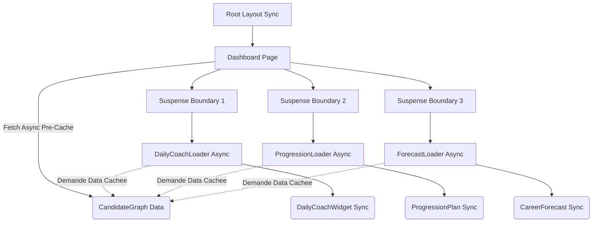

# Server Architecture

## Cible : RSC + Loaders Pattern + Promise Delegation

Pour passer d'un mega-composant bloquant a une interface modulaire et extremement fluide :

**Ordre de rendu** : La Page renvoie son squelette HTML instantanement -> Node execute les Promises en arriere-plan -> React stream chaque Widget vers le client des la resolution de la promise correspondante.
